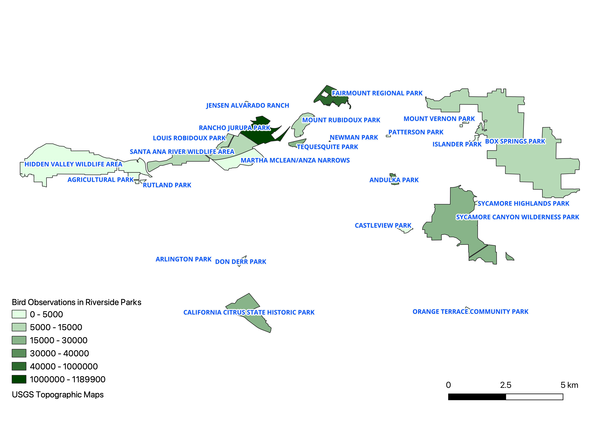

## birds-riverside
The project utilizes Scala, Spark, and Beast framework to merge a spatial dataset of parks in Riverside, CA with a bird observations dataset. The merged dataset is processed to produce a GeoJSON that includes the park name, geographic details, and total number of birds observed in each park.


### Project setup
1. Used the maven archetype to create a maven project. However, the pom.xml still had to be updated for beast version 0.10.0-SNAPSHOT

    ```shell
        mvn archetype:generate "-DgroupId=edu.ucr.cs.cs167.birdObservation" "-DartifactId=birdObservation" "-DarchetypeGroupId=edu.ucr.cs.bdlab" "-DarchetypeArtifactId=beast-spark" "-DarchetypeVersion=0.10.0-SNAPSHOT" -B
    ```
        
2. Downloaded the latest version of [BEAST](https://bitbucket.org/bdlabucr/beast/src/master/) and built it using **mvn clean install** to add all dependencies to my 'local' maven repository

---

### Prerequisites
1. Downloaded the datasets of [ebird](https://star.cs.ucr.edu/?eBird#center=33.9460,-117.3995&zoom=13) as geoJSON and [riversideParks](https://star.cs.ucr.edu/?Riverside/Parks#center=33.9068,-117.4399&zoom=12) as shapeFile. Both these files need to be in the root directory of the project i.e where pom.xml is present

---

### Code

1. Loaded the datasets as SpatialRDD

    ```scala
      val birdDataPoints : SpatialRDD = sparkContext.geojsonFile("eBird.geojson")

      val riversideParkData : SpatialRDD = sparkContext.shapefile("Riverside_Parks.zip")
    ```

2. Performed a spatial join, to get tuples of format : <park,bird>

    ```scala
      val birdsInParkRDD: RDD[(IFeature, IFeature)] = riversideParkData.spatialJoin(birdDataPoints)
    ```

3. For each row in the above birdsInParkRDD , added a column name called Bird with value of OBSERVATION COUNT column from bird feature(data). Since, it was of type string, parsed it as an integer and defaulted value if incase there are exceptions. eg. Some records have entry "X" in Observation count. Also made it null-safe. Converted it to a dataframe

     ```scala
        val birdsInParkDF: DataFrame =birdsInParkRDD.map({ case (park, bird) => Feature.append(park, Try(bird.getAs[String]("OBSERVATION COUNT").toInt).getOrElse(0), "Bird",IntegerType)}).toDataFrame(sparkSession)
    ```

4. Performed a group by operation on "PARK_NAME" i.e to join all rows of bird sightings by the park's name, preserved the geographic info and created a summation of all the birds to store as result data frame. Wrote the output from this result to a GeoJSON output file.
     ```scala
        val result : DataFrame= birdsInParkDF.groupBy("PARK_NAME","g").sum("Bird").as("Bird Observations")

        result.toSpatialRDD.coalesce(1).saveAsGeoJSON("birdsInPark")
    ```

5. Imported the file in QGIS, generated a choropleth map by configuring various settings and setting the right number of classes to understand the map better.
---

### Output
Output file -
[Output GeoJSON](./output.geojson)

Choropleth Map


Choropleth Map with Riverside topography overlay

---
